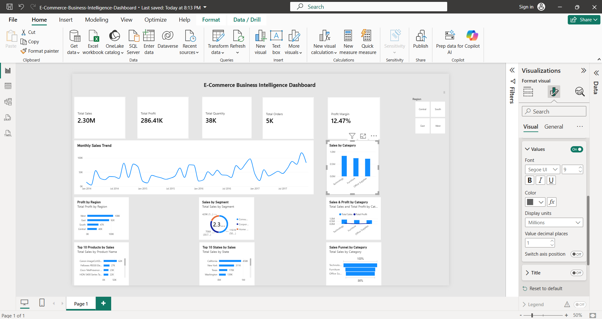

# 🛒 E-Commerce Business Intelligence Dashboard

An interactive **E-Commerce Business Intelligence Dashboard** built using **Microsoft Power BI** to analyze sales, profit, quantity, orders, customer segments, products, states, regions, and categories.

The dashboard transforms raw sales data into meaningful business insights through interactive visualizations and KPIs.

---

## 📊 Dashboard Preview



---

## 🎯 Project Objective

The main objective of this project is to build an interactive Business Intelligence dashboard that helps users:

- Monitor overall sales and profit performance
- Analyze monthly sales trends
- Compare sales across product categories
- Identify profitable regions
- Analyze customer segments
- Identify top-performing products
- Compare sales across different states
- Analyze sales and profit by category
- Explore category-wise sales performance

---

## 📌 Key Performance Indicators

The dashboard includes the following KPIs:

- 💰 **Total Sales**
- 📈 **Total Profit**
- 📦 **Total Quantity**
- 🧾 **Total Orders**
- 📊 **Profit Margin**

---

## 📈 Dashboard Visualizations

The dashboard contains:

1. **Monthly Sales Trend**
2. **Sales by Category**
3. **Profit by Region**
4. **Sales by Segment**
5. **Sales & Profit by Category**
6. **Top 10 Products by Sales**
7. **Top 10 States by Sales**
8. **Sales Funnel by Category**
9. **Region Slicer for Interactive Filtering**

---

## 🛠️ Tools & Technologies

- **Microsoft Power BI**
- **Power Query**
- **DAX**
- **Data Visualization**
- **Data Cleaning & Transformation**
- **Business Intelligence**

---

## 📂 Dataset

The project uses the **Sample Superstore** dataset containing e-commerce sales information such as:

- Order Date
- Sales
- Profit
- Quantity
- Category
- Sub-Category
- Product Name
- Customer Segment
- Region
- State
- Country

---

## 🔍 Key Insights

The dashboard helps identify:

- Overall business sales and profitability
- Monthly sales growth and fluctuations
- Best-performing product categories
- Regional profitability
- Top-performing products
- States generating higher sales
- Customer segment contribution
- Relationship between sales and profit

---

## ✨ Interactive Features

The dashboard provides interactive filtering using the **Region slicer**.

Users can select:

- Central
- East
- South
- West

All connected visuals update dynamically according to the selected region.

---

## 📁 Project Structure

```text
E-Commerce-Business-Intelligence-Dashboard/
│
├── E-Commerce-Business-Intelligence-Dashboard.pbix
├── dashboard.png
└── README.md

🚀 How to Use
Download the .pbix Power BI file.
Open it using Microsoft Power BI Desktop.
Interact with the dashboard visuals and Region slicer.
Explore sales, profit, products, categories, states, and segments.
🎓 Project Type

Business Intelligence / Data Visualization Project

Built as part of practical learning and training in Power BI and Business Intelligence.

👩‍💻 Author

Yashvi Chaudhary

GitHub: yashvi-chaudhary
